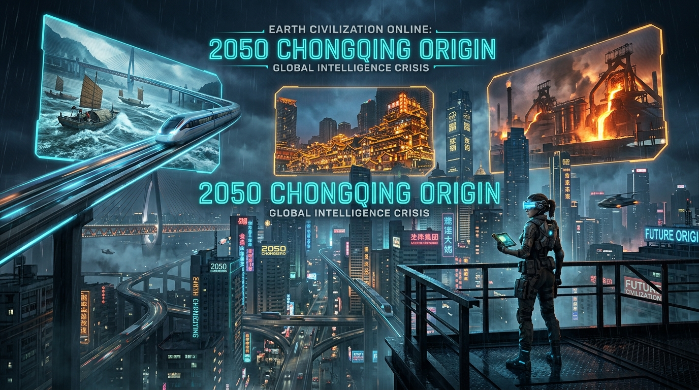
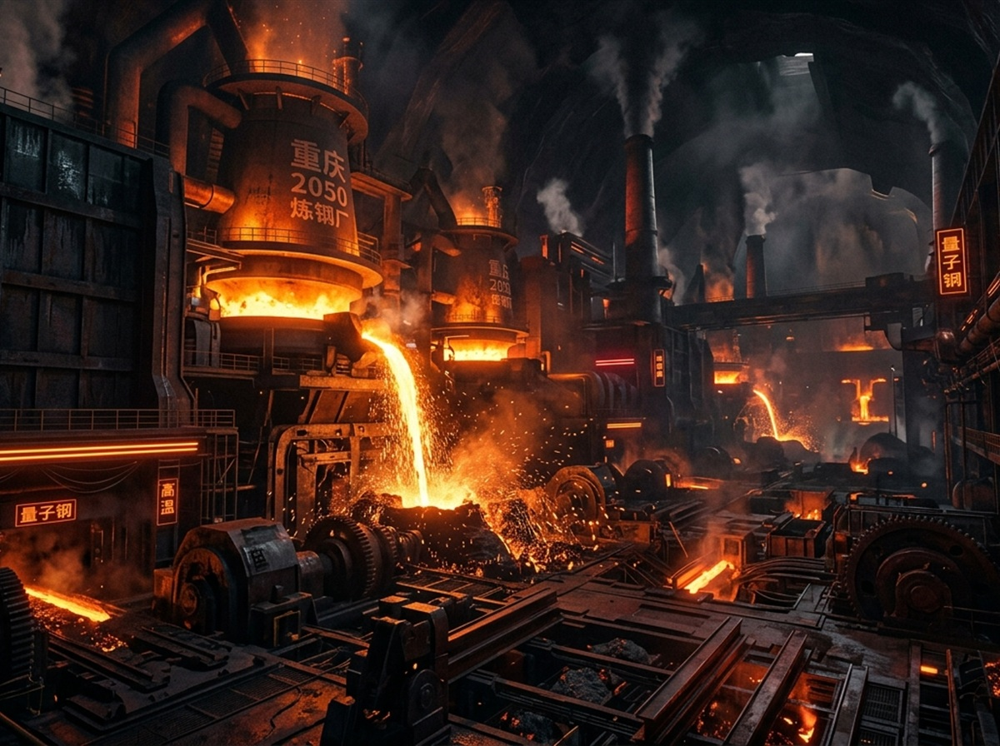
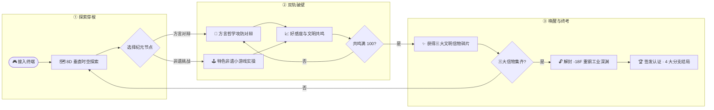
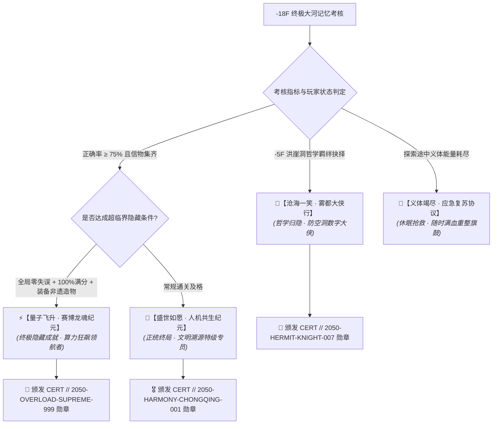
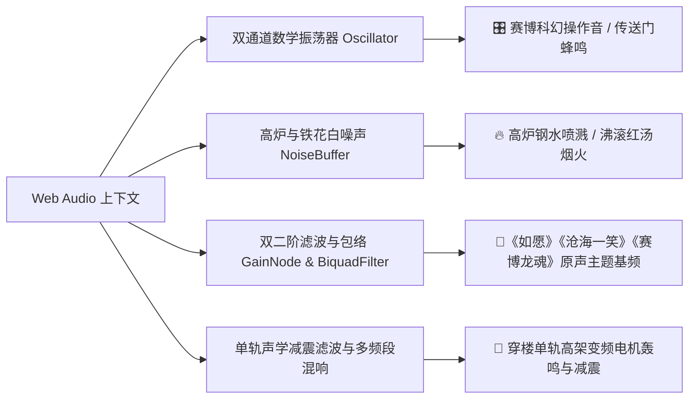

# 🌐 《地球文明Online：山城溯源 2050》

### Earth Civilization Online: ShanCheng Origin 2050

<div align="center">



[](LICENSE)
[](https://github.com/yhn128974/Earth-Civilization-Online-ShanCheng-Origin-2050)
[](https://github.com/yhn128974/Earth-Civilization-Online-ShanCheng-Origin-2050/stargazers)
[](https://github.com/yhn128974/Earth-Civilization-Online-ShanCheng-Origin-2050/network/members)
[](https://react.dev)
[](https://vite.dev)
[](https://www.typescriptlang.org)
[](https://tailwindcss.com)
[](#ai-engine)
[](#audio-engine)

**“以 AI 原生叙事重构 8D 赛博山城时空，在 2050 智能危机中寻回人类文明精神火种。”**

[🌟 GitHub 源码仓库](https://github.com/yhn128974/Earth-Civilization-Online-ShanCheng-Origin-2050) · [🗺️ 8D 垂直时空](#elevation-map) · [🔄 核心游戏循环](#game-loop) · [🧠 AI 容灾中枢](#ai-engine) · [🕹️ 四大小游戏](#mini-games) · [🏆 分支结局](#endings) · [🎼 物理音频](#audio-engine) · [🏛️ 目录架构](#architecture) · [⚡ 极速上手](#quick-start) · [🤝 参与贡献](#contributing) · [📄 开源协议](#license)

</div>

---

<a id="overview"></a>

## 📖 项目简介与核心优势矩阵 (Overview & Advantage Matrix)

《地球文明Online：山城溯源 2050》（Earth Civilization Online: ShanCheng Origin 2050）是一款**深度融合“巴渝非遗文脉传承 × 8D 立体垂直时空构架 × AI 原生叙事与自研动力学互动引擎”的开源 Web 级 RPG 作品**。

故事设定在公元 2050 年，通用人工智能（AGI）失控引发人类文明精神虚无的危机纪元。玩家化身文明特遣专员，神经漫游接入 8D 赛博山城重庆，在李子坝水运智控站、解放碑地表前哨站、洪崖洞悬崖吊脚楼与重钢工业深渊之间穿梭，与搭载地道方言的驻留数字智能体展开哲学攻防与情感唤醒，收集文明宝典碎片，最终在地下百年高炉解封终极历史共鸣大考。

| 优势维度 | 传统 Web / 问答套壳应用 | 本项目核心突破与技术壁垒 |
| :--- | :--- | :--- |
| **🏙️ 空间建构** | 平面网页、单调信息流展示 | **420 米真实落差 8D 垂直时空坐标轴**，虚实映射四大纪元地标 |
| **🧠 AI 架构** | 单一依赖国际 API，易受阻断 | **双国内直连 (DeepSeek/通义千问) + 双国际顶尖 (Gemini/OpenAI) 一键热插拔**，独创 **“全断网零报错”三级离线自愈中枢** |
| **🕹️ 互动体验** | 单纯文字点选或单选题 | **四大全自研动力学小游戏**（扁担重心平衡、单轨减震调速、九宫火候温区、高炉热力模锻） |
| **🎼 声学工程** | 臃肿数十兆的静态音频文件，加载慢 | **0MB 外部声学包体积**，纯原生 **Web Audio API** 实时数学合成物理动态声场 + **68+ 条全量川渝方言高清原声** |
| **🏆 叙事厚度** | 线性固定脚本，体验单一 | **四大多分支结局演播**、川剧面具多重人格切换与生成式防伪加密数字勋章 |
| **📱 工程性能** | 资源体积大、手机排版易错位 | **React 19.2 + Vite 8** 秒级冷启，完美响应 PC 宽屏、平板及手机窄屏触控 |

---

<a id="elevation-map"></a>

## 🗺️ 8D 垂直时空坐标与非遗文脉 (Spatial Architecture & Non-Heritage Lore)

```
 海拔标高                          垂直地标与纪元文明                          核心信物
 +420 米
   ▲   ┌────────────────────────────────────────────────────────┐
  +8F  │ 【李子坝 · 嘉陵江水运智控站】 ── 川江渔猎文明           │ ➔ 【大河渔猎之魂碎片】
       │  穿楼单轨 / 嘉陵巨浪 / 主脑 AI 零号机                  │   (狂澜互助 · 同舟共济)
       └───────────────────────────┬────────────────────────────┘
                                   │ 垂直下行 180 米
   ┼   ┌───────────────────────────┴────────────────────────────┐
  +1F  │ 【解放碑 · 地表溯源前哨站】 ── 现代抗战文脉           │ ➔ 【山城脊梁之竹信物】
       │  十字金街 / 机械义体挑夫 / 向导棒棒 88 号              │   (自食其力 · 硬核筋骨)
       └───────────────────────────┬────────────────────────────┘
                                   │ 悬崖跌落 120 米
   ┼   ┌───────────────────────────┴────────────────────────────┐
  -5F  │ 【洪崖洞 · 悬崖吊脚楼茶肆】 ── 山崖农耕民俗           │ ➔ 【山崖农耕之火碎片】
       │  立体飞檐 / 智能九宫火锅 / 市井盖碗姐                  │   (市井温存 · 人间烟火)
       └───────────────────────────┬────────────────────────────┘
                                   │ 地底深潜 120 米
   ▼   ┌───────────────────────────┴────────────────────────────┐
 -18F  │ 【重钢遗址 · 近代工业深渊】 ── 工业变革史诗           │ ➔ 【文明溯源者终极勋章】
       │  百年熔炉 / 模锻金石 / 守望者钢铁之魂                  │   (千锤百炼 · 钢铁意志)
       └────────────────────────────────────────────────────────┘
```

<table width="100%">
  <thead>
    <tr>
      <th width="25%" align="center">+8F 李子坝 · 水运智控</th>
      <th width="25%" align="center">+1F 解放碑 · 地表前哨</th>
      <th width="25%" align="center">-5F 洪崖洞 · 悬崖烟火</th>
      <th width="25%" align="center">-18F 重钢遗址 · 工业深渊</th>
    </tr>
  </thead>
  <tbody>
    <tr>
      <td align="center"></td>
      <td align="center"></td>
      <td align="center"></td>
      <td align="center"></td>
    </tr>
    <tr>
      <td align="center"><b>嘉陵狂澜 · 纤夫号子</b></td>
      <td align="center"><b>精神坐标 · 山城硬骨</b></td>
      <td align="center"><b>依山借势 · 万家灯火</b></td>
      <td align="center"><b>抗战西迁 · 钢铁意志</b></td>
    </tr>
  </tbody>
</table>

---

<a id="game-loop"></a>

## 🔄 核心游戏循环 (Game Loop)



---

<a id="ai-engine"></a>

## 🧠 多基座大模型热插拔与高可用容灾 (AI Architecture & Fault Tolerance)

针对跨域、复杂公网与偶发离线状态，构建了开箱即用的多级路由与无感容灾中枢：

```mermaid
flowchart LR
    User[👤 玩家交互输入] --> NavRouter{导航栏模型路由器}

    subgraph 🇨🇳 国内极速直连 [国内骨干网 · 免翻墙]
        DS[DeepSeek V3 / R1]
        QW[阿里通义千问 Qwen 2.5]
    end

    subgraph 🌐 国际顶尖基座 [支持自定义反代 Base URL]
        GM[Google Gemini 2.5 / 3.1]
        OA[OpenAI GPT-4o]
    end

    subgraph 🛡️ 离线自愈中枢 [0 网络依赖 · 绝对不白屏]
        LocalEngine[四大角色专属川渝方言自愈模板库]
    end

    NavRouter -->|国内推荐| DS & QW
    NavRouter -->|国际通道| GM & OA
    NavRouter -->|离线保底| LocalEngine

    DS & QW & GM & OA -. 网络中断 / 429 限流 / 超时 / 无Key .-> LocalEngine

    LocalEngine --> Render[🗣️ 拟真方言回复 + 顶部温和导流提示]
    DS & QW & GM & OA --> Render
```

| 模型提供商 | 接入特性 | 平均时延 | 适用场景与接入地址 |
| :--- | :--- | :---: | :--- |
| **DeepSeek (V3 / R1)** | 国内高速直连 · 免翻墙 | `~300ms` | **国内网络强烈推荐**，逻辑思辨极佳 · [DeepSeek 开放平台](https://platform.deepseek.com) |
| **阿里通义千问 (Qwen 2.5)** | 阿里云国内骨干网直连 | `~260ms` | **企业级高并发稳定**，合规安全 · [阿里云百炼平台](https://bailian.console.aliyun.com) |
| **Google Gemini (3.1/2.5)** | 需代理环境 / 出厂内置 | `~450ms` | **原生官方信标默认支持** · [Google AI Studio](https://aistudio.google.com) |
| **OpenAI (GPT-4o)** | 需代理环境 / 支持反代 | `~500ms` | **全球通用基准**，支持 One-API 与自定义 Base URL · [OpenAI 官网](https://platform.openai.com) |
| **离线方言拟真引擎** | **0 网络依赖 (全断网)** | `0ms` | **绝对防报错保底**，内置数百条契合剧情深度的鲜活方言逻辑库 |

---

<a id="mini-games"></a>

## 🕹️ 四大自研物理动力学小游戏 (Custom Mini-Game Engines)

本项目拒绝纯文本交互，全链路自研了具备交互物理学的 4 款非遗实操小游戏，并在外层配置 `MiniGameErrorBoundary` 统一兜底，保障在任何意外错误下快速自愈隔离：

```
  【1. 解放碑 · 山城挑运】                     【2. 李子坝 · 穿楼单轨】
   动态重心平衡操控 (A/D 或 触控扶正)            多区间时速调度阻尼 (W/S 提速与制动)
  ┌─────────────────────────┐               ┌─────────────────────────┐
  │ [   ▲重心稳定区±12°▲  ] │               │ 距站台: 498M | 时速:65km│
  │ ◀───[ ⚖️ 重心点 ]───▶    │               │ [▓▓▓▓▓▓▓▓▓░░░] 巡航安全 │
  │ 步道蹬阶: 18 / 80 米     │               │ 🛡️ 消噪护盾: 运行中 5dB │
  └─────────────────────────┘               └─────────────────────────┘

  【3. 洪崖洞 · 九宫火锅】                     【4. 重钢遗址 · 量子模锻】
   九宫格多温区火候捞烫 (点击对应格子)           节奏环收缩与热力学 (空格精准锻打)
  ┌───────┬───────┬───────┐                 ┌─────────────────────────┐
  │ 微火  │ 中火  │ 微火  │                 │ 炉温: 1550℃ [最佳温区]  │
  │ 豆腐  │ 牛肉  │ 藕片  │                 │ ◄───[ 绿色靶心 ]───●落锤│
  ├───────┼───────┼───────┤                 │ 连续淬炼: 3 / 5 锤      │
  │ 中火  │ 猛火  │ 中火  │                 │ 钢坯完整度: 100%        │
  │ 肉丸  │ 毛肚鸭│ 酥肉  │                 └─────────────────────────┘
  └───────┴───────┴───────┘
```

1. **🎋 山城挑运 · 步道平衡挑战（+1F 解放碑）**：
   - 重心偏角力学演算（±50°），±12° 为安全平衡区；
   - 键盘 `A / D` 或屏幕按钮调整扁担平衡，`空格 / 按钮` 换腿交替稳步攀爬 80 米十八梯；
   - 融入动态体力耐力消耗与失衡防护重试机制。
2. **🚝 穿楼单轨 · 时速调度模拟（+8F 李子坝）**：
   - 跨江直道（60-80 km/h 极速巡航）➔ 半山急弯（35-58 km/h 减速压弯）➔ 穿楼进站（≤38 km/h + 开启消噪）；
   - `W` 牵引加速、`S` 制动减速，进入进站区间按 `空格` 开启消噪护盾，环境分贝骤降至 5dB 达标进站。
3. **🍲 九宫格火锅 · 捞烫大师（-5F 洪崖洞）**：
   - 严谨还原老巴渝非遗九宫格火候口诀：中心猛火烫毛肚鸭肠（6s）、十字中火煮牛肉丸子（9-11s）、四角微火煨豆腐藕片（12-14s）；
   - 200ms 精密火候计时器与绿色爽脆黄金捞烫窗口，匹配盖碗姐催单赢取高额赏格与底料道具。
4. **⚙️ 量子高炉 · 重工钢铁锻造（-18F 重钢遗址）**：
   - 模拟汉阳铁厂西迁工匠意志，高炉温度自然衰减，按 `F` 鼓风升温、按 `C` 溶剂降温维持在 1420-1680°C；
   - 金色光环随节拍收缩，精确至绿色靶心判定瞬间按 `空格` 落锤，5 锤淬火终极成钢。

---

<a id="endings"></a>

## 🏆 四大分支结局与动态数字认证 (Branching Endings & Digital Verification)



| 结局名称 | 分支类型 | 达成前置条件 | 核心演播与专属声乐 | 官方勋章认证 |
| :--- | :---: | :--- | :--- | :--- |
| **🌟 盛世如愿 · 人机共生纪元** | **正统终局** | 答题正确率 ≥ 75% | 四大守护者全息投影屹立解放碑顶，全球危机终结，合奏《如愿 · 山城溯源》原声诗歌 | `★ 官方终极认证 · 文明溯源特级专员 ★` |
| **⚡ 量子飞升 · 赛博龙魂纪元** | **终极隐藏** | **全局零失误** + **大考 100% 满分** + **装备巴渝非遗造物** (川剧面具/聚能底料) | 1500°C 量子高炉超临界爆发，4096 纳米面具覆写全球死锁，赛博金龙啸聚两江，掌控二级恒星算力 | `★ 官方隐藏分支 · 算力狂飙领航者 ★` |
| **🍵 沧海一笑 · 雾都大侠行** | **哲学归隐** | 在洪崖洞悬崖茶肆选择放弃算力争霸，留驻人间烟火 | 远离冷光算力角逐，防空洞悬崖深处盖碗翻扣架船，守望万家灯火，古琴泛音《沧海一笑》 | `★ 特殊哲学分支 · 防空洞数字大侠 ★` |
| **🔋 义体竭尽 · 应急复苏协议** | **故障复苏** | 探索途中义体能量 (Energy) 耗尽归零 | 棒棒 88 号与盖碗姐送达滚烫油茶与备用电池，启动休眠保护，一键满血复苏继续征程 | 紧急复苏重整旗鼓 |

---

<a id="audio-engine"></a>

## 🎼 0MB 纯物理程序化音频引擎与全量方言语音 (Audio & Voice Engine)

彻底告别动辄数十兆的臃肿静态音频资源，全链路采用浏览器原生 **Web Audio API** 纯数学计算生成，并内置 68+ 条专属地道川渝方言真人级语音包：



- **全量地道方言语音**：包含棒棒 88 号、盖碗姐、钢铁之魂、主脑 AI 零号机等角色的丰富川渝地道方言配音（位于 `public/audio/`）。
- **终局情感原声**：通关专属合奏主题乐章《如愿 · 山城溯源》多重声学渲染。

---

<a id="architecture"></a>

## 🏛️ 项目工程目录架构 (Architecture & File Tree)

```
Earth-Civilization-Online-ShanCheng-Origin-2050/
├── public/                       # 静态高清场景、官方视觉资产与语音库
│   ├── cover.jpg                 # 游戏主视觉海报
│   ├── banner.jpg                # 2050 赛博山城宽幅全景
│   ├── chongqing_medal.jpg       # 终局防伪荣誉勋章纹章
│   ├── liziba.jpg / jiefangbei.jpg / hongyadong.jpg / chonggang.jpg
│   ├── avatar_*.jpg              # 四大 NPC 官方全息头像
│   ├── audio/                    # 68+ 条四大角色专属地道川渝方言全语音库与主题曲
│   └── video/                    # 官方实机演示视音频
├── src/
│   ├── components/               # 核心业务组件库
│   │   ├── minigames/            # 四大非遗互动小游戏自研引擎
│   │   │   ├── HotpotMasterGame.tsx    # 九宫格火锅捞烫引擎 (热力分区与起落判定)
│   │   │   ├── MonorailPilotGame.tsx   # 穿楼单轨调度引擎 (时速动力学与消噪护盾)
│   │   │   ├── PorterBalanceGame.tsx   # 山城挑运步道引擎 (重力偏角与蹬阶力学)
│   │   │   └── SteelForgingGame.tsx    # 量子高炉模锻引擎 (热力学衰减与收缩节拍)
│   │   ├── MiniGameModal.tsx     # 包含 MiniGameErrorBoundary 的小游戏隔离视窗
│   │   ├── ApiConfigModal.tsx    # 主流大模型 Key/BaseURL 热切换中枢 (支持 2国内+2国际)
│   │   ├── EndingModal.tsx       # 4 大影视级分支结局演播与防伪勋章殿堂
│   │   ├── NpcDialogueModal.tsx  # 方言多轮对话终端、答题考核与零失误裁决机
│   │   ├── LocationMap.tsx       # 8D 垂直落差时空星图
│   │   ├── InventoryModal.tsx    # 战术包裹与巴渝非遗工坊 (面具/底料熔铸)
│   │   ├── OpeningCinematic.tsx  # 3D 景深序幕视效
│   │   ├── DistressedGlassOverlay.tsx # 赛博战术磨砂毛玻璃护盾覆层
│   │   └── Navbar.tsx            # 顶部实时状态、能量槽与模型快速指示器
│   ├── constants/
│   │   └── gameConfig.ts         # 游戏核心数值、阶段常量与预设路由
│   ├── data/
│   │   └── gameData.ts           # 地标、NPC 设定、考核题库与非遗道具数据
│   ├── types/
│   │   └── game.ts               # TypeScript 严格类型契约
│   ├── utils/
│   │   ├── ai.ts                 # 多模型统一适配器、提示词引擎与离线自愈模板库
│   │   ├── audio.ts              # 0MB Web Audio 物理声学引擎与歌词唱诵器
│   │   └── security.ts           # 多态加密安全信标编解码工具
│   ├── App.tsx                   # 全局状态调度机与游戏生命周期引擎
│   ├── main.tsx                  # 应用入口点
│   └── index.css                 # 赛博朋克深邃质感与粒子动效设计系统
├── scripts/                      # 配音合成与数据生成工作流
│   ├── generate_npc_voices.mjs   # NPC 方言全语音自动生成脚本
│   └── generate_steel_voices.mjs # 钢铁守望者专属重工音色生成脚本
├── index.html                    # 页面外壳与视口配置
├── package.json                  # 依赖清单 (React 19 + Vite 8 + TailwindCSS 4)
├── vite.config.ts                # Vite 极速构建配置
├── LICENSE                       # MIT 开源许可证文件
└── README.md                     # 项目技术全景与架构指南
```

---

<a id="quick-start"></a>

## ⚡ 极速上手指南与配置 (Quick Start & Configuration)

### 1. 环境准备与本地运行

确保本机安装了 Node.js（推荐 `v18.0.0` 或更高版本）：

```bash
# 1. 克隆 GitHub 仓库
git clone https://github.com/yhn128974/Earth-Civilization-Online-ShanCheng-Origin-2050.git

# 2. 进入项目工作目录
cd Earth-Civilization-Online-ShanCheng-Origin-2050

# 3. 安装依赖包
npm install

# 4. 启动本地热重载开发服务器
npm run dev
```

启动成功后，浏览器访问 `http://localhost:5173` 即可开箱即玩！

### 2. 生产级打包与预览

```bash
# 执行 TypeScript 类型校验与静态压缩构建
npm run build

# 本地快速预览构建产物
npm run preview
```

### 3. 可选环境变量配置

本项目具备**零门槛开箱即玩**特性，本地无需配置 `.env` 即可畅玩（内置加密信标与离线自愈引擎）。如需绑定自定义 API Key，可复制并配置 `.env`：

```ini
# --- [国内主流大模型配置 (推荐免代理用户)] ---
VITE_DEEPSEEK_API_KEY=your_deepseek_api_key_here
VITE_DEEPSEEK_BASE_URL=https://api.deepseek.com

VITE_QWEN_API_KEY=your_dashscope_api_key_here
VITE_QWEN_BASE_URL=https://dashscope.aliyuncs.com/compatible-mode/v1

# --- [国际主流大模型配置] ---
VITE_GEMINI_API_KEY=your_gemini_api_key_here
VITE_OPENAI_API_KEY=your_openai_api_key_here
```

> [!TIP]
> 游戏中更推荐直接点击主界面顶部导航栏的 **「🤖 模型」** 按钮，无需重启服务即可即时热换模型与填入 Key！

---

<a id="contributing"></a>

## 🤝 参与贡献与社区 (Contributing & Star History)

欢迎提交 Issue 与 Pull Request 共同完善巴渝赛博世界！

1. Fork 本项目到你的 GitHub：[https://github.com/yhn128974/Earth-Civilization-Online-ShanCheng-Origin-2050](https://github.com/yhn128974/Earth-Civilization-Online-ShanCheng-Origin-2050)
2. 创建特性分支 (`git checkout -b feature/AmazingFeature`)
3. 提交代码更改 (`git commit -m 'feat: Add some AmazingFeature'`)
4. 推送分支 (`git push origin feature/AmazingFeature`)
5. 在 GitHub 发起 Pull Request

如果你喜欢这个项目，欢迎点亮右上角的 ⭐️ **Star** 支持！

[](https://star-history.com/#yhn128974/Earth-Civilization-Online-ShanCheng-Origin-2050&Date)

---

<a id="license"></a>

## 📄 开源许可证 (License)

本项目基于 [MIT License](LICENSE) 开源协议分发与使用。欢迎自由交流与非商业化学习研究！
